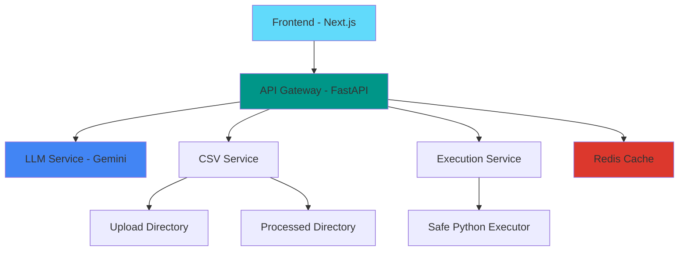

# 🤖 AI CSV Cleaner

<div align="center">


*Uma plataforma inteligente para limpeza e processamento de dados CSV usando Large Language Models*

[Demo](#-demonstração) • [Instalação](#-instalação-rápida) • [Documentação](#-documentação-da-api) • [Contribuir](#-contribuindo)

</div>

## 🎯 Visão Geral

Este projeto é uma aplicação web fullstack desenvolvida como parte de uma avaliação técnica. A aplicação permite que usuários façam o upload de um arquivo CSV, que é então analisado por um Large Language Model (LLM) para gerar dinamicamente um script de limpeza em Python. O script é executado no backend para tratar os dados, e o resultado final é exibido ao usuário.

### 🚀 Principais Características

- **🧠 Inteligência Artificial**: Análise automática de dados e geração de scripts com Google Gemini
- **🔒 Execução Segura**: Ambiente controlado e isolado para execução de scripts
- **⚡ Performance**: Interface responsiva com feedback em tempo real
- **📊 Visualização**: Exibição interativa dos dados processados
- **🐳 Containerizado**: Deploy simplificado com Docker
- **📈 Monitoramento**: Sistema de logs estruturado e cache Redis

## 🏗️ Arquitetura



### 📁 Estrutura do Projeto

```bash
fs_data_processor/
├── 🐳 .docker/                 # Configurações Docker
│   ├── Dockerfile.api         # Backend container
│   ├── Dockerfile.ui          # Frontend container
│   ├── requirements.txt       # Dependências Python
│   └── .env.example          # Variáveis de ambiente
├── 🚀 backend/                # API FastAPI
│   ├── api/                  # Rotas e endpoints
│   ├── core/                 # Configurações centrais
│   ├── models/               # Schemas Pydantic
│   ├── services/             # Lógica de negócio
│   ├── upload/               # Arquivos carregados
│   └── processed/            # Arquivos processados
├── 🎨 frontend/               # Interface Next.js
├── 🐋 docker-compose.yml      # Orquestração de containers
└── 📜 run.sh                 # Script de automação
```

## ✨ Funcionalidades

### 🔄 Fluxo de Processamento

1. **📤 Upload Inteligente**
   - Validação de formato e tamanho
   - Geração de UUID único
   - Análise inicial dos dados

2. **🤖 Análise com IA**
   - Detecção automática de problemas
   - Geração de script personalizado
   - Otimização para pandas

3. **⚙️ Execução Segura**
   - Ambiente sandbox isolado
   - Timeout de segurança
   - Validação de sintaxe

4. **📊 Resultado Final**
   - Dados limpos e estruturados
   - Download em formato CSV
   - Visualização interativa

### 🛠️ Tratamentos Automáticos

- ✅ **Valores Nulos**: Preenchimento inteligente baseado no contexto
- ✅ **Duplicatas**: Remoção automática de registros duplicados
- ✅ **Tipos de Dados**: Conversão automática para tipos apropriados
- ✅ **Formatação**: Padronização de datas, emails e nomes
- ✅ **Sequências**: Preenchimento de gaps em sequências numéricas
- ✅ **Validação**: Detecção e correção de dados inválidos

## 🚀 Instalação Rápida

### 📋 Pré-requisitos

- **Docker** 20.10+ & **Docker Compose** 2.0+
- **Git** para clonagem do repositório
- **API Keys** do Google Gemini ou OpenAI

### ⚡ Setup em 3 Passos

1. **Clone e Configure**

   ```bash
   git clone https://github.com/OliveiraLeonidas/fs_data_processor.git
   cd fs_data_processor
   cp .docker/.env.example .docker/.env
   ```

2. **Configure as API Keys**

   ```bash
   # Edite o arquivo .docker/.env
   GEMINI_SECRET_KEY="sua_chave_gemini_aqui"
   OPENAI_SECRET_KEY="sua_chave_openai_aqui"  # Opcional
   ```

3. **Build e Execute**

   ```bash
   chmod +x run.sh
   ./run.sh --build         # Build para desenvolvimento
   ./run.sh --run           # Executar aplicação
   ```

### 🌐 Acesso

- **Frontend**: http://localhost:3001
- **API Docs**: http://localhost:8000/docs
- **Health Check**: http://localhost:8000

## 🔧 Tech Stack Detalhada

### Backend (API)
| Tecnologia | Versão | Uso |
|------------|--------|-----|
| **Python** | 3.13+ | Linguagem principal |
| **FastAPI** | 0.116.1 | Framework web moderno |
| **Pandas** | 2.3.2 | Manipulação de dados |
| **Google GenAI** | 0.8.5 | Integração com Gemini |
| **Redis** | 6.4.0 | Cache  |
| **Pydantic** | 2.11.7 | Validação de dados |

### Frontend (UI)
| Tecnologia | Versão | Uso |
|------------|--------|-----|
| **Next.js** | 15+ | Framework React |
| **TypeScript** | 5.0+ | Tipagem estática |
| **Tailwind CSS** | 4.0 | Estilização |
| **Shadcn/UI** | Latest | Componentes UI |

### DevOps & Infraestrutura
- **Docker** + **Docker Compose** para containerização
- **Redis** para cache distribuído
- **Ubuntu 22.04** como base dos containers

## 📖 Documentação da API

### 🔗 Endpoints Principais

| Método | Endpoint | Descrição |
|--------|----------|-----------|
| `POST` | `/api/v1/upload` | Upload de arquivo CSV |
| `POST` | `/api/v1/process` | Processar com LLM |
| `POST` | `/api/v1/execute` | Executar script gerado |
| `GET` | `/api/v1/result/{file_id}` | Obter dados processados |
| `GET` | `/api/v1/download/{file_id}` | Download do arquivo |
| `GET` | `/api/v1/status/{file_id}` | Status do processamento |

### 🔄 Exemplo de Uso Completo

```bash
# 1. Upload do arquivo
curl -X POST "http://localhost:8000/api/v1/upload" \
  -H "Content-Type: multipart/form-data" \
  -F "file=@dados.csv"

# Resposta: {"filename": "dados.csv", "file_id": "uuid-aqui"}

# 2. Processar com IA
curl -X POST "http://localhost:8000/api/v1/process?file_id=uuid-aqui"

# 3. Executar script
curl -X POST "http://localhost:8000/api/v1/execute?file_id=uuid-aqui"

# 4. Download do resultado
curl -X GET "http://localhost:8000/api/v1/download/uuid-aqui" \
  --output dados_limpos.csv
```

## 🔐 Segurança

### 🛡️ Medidas Implementadas

- **Validação Rigorosa**: Verificação de extensão, tamanho e formato
- **Sandbox Execution**: Scripts executados em ambiente isolado
- **Whitelist de Funções**: Apenas funções seguras são permitidas
- **Timeout Protection**: Limite de tempo para execução
- **Input Sanitization**: Sanitização de todas as entradas
- **API Key Protection**: Chaves armazenadas como variáveis de ambiente

### ⚠️ Funções Bloqueadas

```python
DANGEROUS_MODULES = {"os", "sys", "subprocess", "socket", "urllib", "requests"}
DANGEROUS_FUNCTIONS = {"exec", "eval", "open"}
```

## 🎯 Casos de Uso

### 📊 Cenários Ideais

- **Limpeza de Dados CRM**: Padronização de informações de clientes
- **Processamento de Vendas**: Tratamento de dados de e-commerce
- **Análise Financeira**: Limpeza de relatórios contábeis
- **Pesquisa Acadêmica**: Preparação de datasets para análise
- **Migração de Dados**: Tratamento antes de importações

### 📈 Benefícios

- ⚡ **95% menos tempo** no tratamento de dados
- 🎯 **Precisão aumentada** com IA especializada
- 🔄 **Reprodutibilidade** através de scripts salvos
- 📊 **Insights automáticos** sobre qualidade dos dados

## 🧪 Desenvolvimento

### 🏃 Executar Localmente

```bash
# Backend
cd backend
python -m venv venv
source venv/bin/activate  # Linux/Mac
# venv\Scripts\activate   # Windows
pip install -r requirements.txt
fastapi dev backend/main.py

# Frontend (em outro terminal)
cd frontend
npm install
npm run dev
```

### 📝 Comandos Úteis

```bash
# Logs dos containers
docker-compose logs -f

# Rebuild sem cache
./run.sh --build

# Parar todos os serviços
docker-compose down

# Limpar volumes
docker-compose down -v
```

## 🔧 Configuração Avançada

### 🌐 Variáveis de Ambiente

```bash
# .docker/.env
DATAPROCESSOR_BACKEND_PORT=8000
DATAPROCESSOR_FRONTEND_PORT=3001
GEMINI_SECRET_KEY="sua_chave_aqui"
OPENAI_SECRET_KEY="sua_chave_aqui"

# Limites de segurança
MAX_FILE_SIZE=10485760  # 10MB
EXECUTION_TIMEOUT=30    # 30 segundos
MAX_SCRIPT_LENGTH=10000 # 10k caracteres
```

### 🚀 Deploy em Produção

```bash
# Build para produção
docker build -t ai-csv-cleaner:prod .

# Com Nginx como proxy
docker run -d -p 80:80 nginx:alpine
```

## 🐛 Troubleshooting

### ❓ Problemas Comuns

| Problema | Solução |
|----------|---------|
| **Container não inicia** | Verifique se as portas 3001 e 8000 estão livres |
| **Erro de API Key** | Confirme se as chaves estão no arquivo `.env` |
| **Upload falha** | Verifique se o arquivo é CSV válido (<10MB) |
| **Redis connection** | Certifique-se que o container Redis está rodando |

### 📋 Logs Estruturados

```bash
# Ver logs específicos
docker logs backend
docker logs frontend
docker logs cachedb

# Logs em tempo real
docker-compose logs -f backend
```

## 🤝 Contribuindo

### 🌟 Como Contribuir

1. **Fork** o repositório
2. **Crie** uma branch: `git checkout -b feature/nova-feature`
3. **Teste** suas mudanças: `pytest && npm test`
4. **Commit** suas mudanças: `git commit -m 'feat: adiciona nova feature'`
5. **Push** para a branch: `git push origin feature/nova-feature`
6. **Abra** um Pull Request

### 📋 Padrões de Código

- **Backend**: Follow PEP 8, use type hints
- **Frontend**: Prettier + ESLint configurado
- **Commits**: Conventional Commits format
- **Testes**: Cobertura mínima de 80%

### 🐛 Reportar Bugs

Use as [issues do GitHub](https://github.com/OliveiraLeonidas/fs_data_processor/issues) com:
- Descrição clara do problema
- Passos para reproduzir
- Ambiente (OS, Docker version, etc.)
- Logs relevantes

## 📄 Licença

Este projeto está licenciado sob a **MIT License**. Veja o arquivo [LICENSE](LICENSE) para detalhes.

## 📞 Suporte

- 📧 **Email**: [contato](mailto:oliveiraleonidas99@gmail.com)
- 💬 **GitHub Issues**: [Criar Issue](https://github.com/OliveiraLeonidas/fs_data_processor/issues)

---

<div align="center">

**Desenvolvido com ❤️ por [Leonidas Oliveira](https://github.com/OliveiraLeonidas)**

⭐ Se este projeto te ajudou, considere dar uma estrela!

</div>